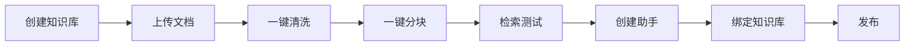
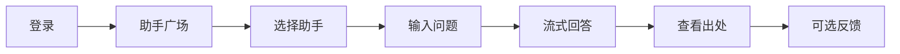
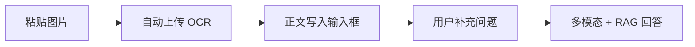

# AI 法律顾问助手 — 产品需求文档（PRD）

**文档版本**：v1.0  
**产品名称**：AI 法律顾问助手（legal-ai-advisor）  
**更新日期**：2026-06-05  
**状态**：已上线（MVP+）

---

## 1. 产品概述

### 1.1 产品定位

面向企业与法务/合规团队的 **AI 知识问答助手**，基于企业自建法律知识库，结合大模型（阿里云 qwen 系列）提供多轮咨询、检索增强生成（RAG）回答。系统强调 **可溯源、结构化输出、知识库可控**，适用于人事、合同、合规等内部咨询场景。

### 1.2 产品目标

| 目标 | 说明 |
|------|------|
| 降低重复咨询成本 | 将制度、法规文档结构化入库，自动召回作答 |
| 提升回答一致性 | 固定回答版式 + 出处标注 + 问答缓存 |
| 降低使用门槛 | 助手广场一键咨询，支持流式对话与图片识别 |
| 保障内容可控 | 管理员维护知识库、助手、问答库与运营数据 |

### 1.3 免责声明

系统回答由 AI 生成，**仅供参考，不构成正式法律意见**。重大事项应咨询执业律师或查阅原始法规文本。

---

## 2. 用户与角色

### 2.1 角色定义

| 角色 | 标识 | 权限范围 |
|------|------|----------|
| **管理员** | `admin` | 全功能：知识库、专家管理、用户管理、运营统计、问答库 |
| **咨询用户** | `consultant` | 助手广场、发起咨询对话、查看自己的会话历史 |

### 2.2 认证方式

- JWT 登录，Token 本地持久化
- 除 `/login`、`/health`、分享链接外，API 需 `Authorization: Bearer <token>`
- 默认管理员账号：`admin` / `LegalAi@2026`（可在 `backend/.env` 配置）

---

## 3. 功能架构

```
┌─────────────────────────────────────────────────────────┐
│                      前端（Vue 3）                        │
├──────────┬──────────┬──────────┬──────────┬──────────────┤
│ 助手广场  │ 咨询对话  │ 知识库   │ 专家管理  │ 运营/问答库   │
└────┬─────┴────┬─────┴────┬─────┴────┬─────┴──────┬───────┘
     │          │          │          │            │
┌────▼──────────▼──────────▼──────────▼────────────▼───────┐
│              后端 API（FastAPI + SQLite）                   │
├──────────┬──────────┬──────────┬──────────┬──────────────┤
│ 对话/RAG │ 文档处理  │ 向量检索  │ 多模态   │ 用户/统计    │
└────┬─────┴────┬─────┴────┬─────┴────┬─────┴──────┬───────┘
     │          │          │          │            │
┌────▼──────────▼──────────▼──────────▼────────────▼───────┐
│     DashScope（qwen-turbo / qwen-vl-plus / embedding）    │
└───────────────────────────────────────────────────────────┘
```

### 3.1 技术栈

| 层级 | 技术 |
|------|------|
| 前端 | Vue 3、Vite、Element Plus、Pinia、Vue Router |
| 后端 | Python FastAPI、SQLAlchemy、SQLite |
| AI | 阿里云 DashScope（qwen-turbo、qwen-vl-plus、text-embedding） |
| 通信 | REST API、SSE 流式、WebSocket（文档进度） |

---

## 4. 功能需求详述

### 4.1 助手广场

**面向**：全体登录用户

**功能描述**：

- 展示已发布的 AI 助手卡片（内置 8 位领域助手 + 管理员自定义助手）
- 内置助手领域：
  - 人力资源助手
  - 合同审查助手
  - 客户服务助手
  - 企业合规助手
  - 制度文档助手
  - 保险理赔助手
  - 财税政策助手
  - 知识产权助手
- 点击「立即咨询」创建用户专属会话并进入对话页
- 侧边栏展示「最近咨询」快捷入口

**业务规则**：

- 仅 `is_published=true` 且已绑定知识库的自定义助手对外可见
- 咨询用户不可直接进入专家模板配置页

---

### 4.2 咨询对话

**面向**：全体登录用户

#### 4.2.1 核心能力

| 能力 | 说明 |
|------|------|
| 多轮对话 | 基于会话历史 + 知识库 RAG 生成回答 |
| SSE 流式输出 | 实时显示生成过程，带光标动画 |
| 固定回答版式 | 结论 → 依据 → 注意事项（可选）→ 回答依据出处 → 兜底回复（可选） |
| 出处展示 | 系统自动拼接检索片段；「回答依据出处」支持折叠/展开 |
| 问答缓存 | 高置信度相同问题直接返回缓存答案（流式回放） |
| 消息反馈 | 点赞/点踩，同步至问答库采纳度 |
| 图片解读 | 输入框粘贴/拖放/选择图片，自动 OCR 解析写入输入框 |
| 多模态问答 | 发送时可携带 `image_ids`，使用 `qwen-vl-plus` 结合知识库作答 |
| 分享对话 | 生成只读分享链接（`/share/:token`） |
| 导出对话 | 导出会话记录 |

#### 4.2.2 回答版式规范

| 章节 | 必填 | 说明 |
|------|------|------|
| 结论 | 是 | 一两句话给出直接、可执行的结论 |
| 依据 | 是 | 理由与依据，可分条陈述 |
| 注意事项 | 否 | 存在风险、例外、合规提醒时输出 |
| 回答依据出处 | 系统填写 | 模型不得输出；由 RAG 检索结果自动拼接 |
| 兜底回复 | 否 | 知识库不足时补充通用说明 |

**展示规则**：

- 标题前端加粗放大（15px）
- 禁止使用 Markdown 符号
- 低相关度出处（相似度 < 0.35）自动过滤
- 「回答依据出处」默认折叠，点击展开/收起

#### 4.2.3 图片识别交互

| 环节 | 行为 |
|------|------|
| 上传 | 支持粘贴、拖放、文件选择 |
| 预览区 | 仅显示「解析中…」「解析完成」，不展示大段识别正文 |
| 写入输入框 | 纯文本，无 Markdown，段落间无空行，无 `【图片识别·文件名】` 前缀 |
| 发送 | 可携带图片 ID，触发多模态 + 知识库联合回答 |

**限制**：

- 单张图片默认 ≤ 5MB
- 单会话最多 3 张图片

---

### 4.3 知识库管理

**面向**：管理员

#### 4.3.1 知识库列表

- 创建、编辑、删除知识库
- 展示文档数量、类型等元信息
- 支持知识库类型：`legal`（法规）、`case`（案例）

#### 4.3.2 文档文件（文件列表 Tab）

| 功能 | 说明 |
|------|------|
| 上传文件 | 支持 txt / md / pdf / csv / docx，单文件默认 ≤ 50MB |
| 一键清洗 | 批量启动清洗任务 |
| 一键分块 | 对已清洗文档批量分块 |
| 单文档操作 | 清洗、分块、重命名、下载、删除 |
| 启用开关 | 控制文档是否参与检索 |
| 时效标签 | 「疑似废止」「有修订」；悬停预览 + 点击查看命中原因 |
| 列表滚动 | 工具栏/分页固定，表格区域可上下滚动 |

**文档处理流水线**：

```
上传 → 清洗 → 分块 → 向量化 → 入库检索
```

**清洗能力**（可在知识库配置中开关）：

| 规则 | 说明 |
|------|------|
| 去噪声 | 页眉页脚、水印、目录 |
| 去格式 | 剥离 HTML / 样式标签 |
| 表格处理 | 转为结构化描述 |
| 去冗余 | 重复段落、废止标记 |
| 字符规范化 | 全半角、乱码处理 |

**时效性检测**（清洗后自动执行）：

- 扫描正文中的废止、修订、失效等表述
- 标记级别：
  - `warning`：疑似废止（红色标签）
  - `info`：有修订（蓝色标签）
- 列表悬停显示首条命中摘要
- 点击标签弹窗展示分类命中原因（废止/失效、修订/施行）

**分块策略**：

- 检测到「第一条」「第1章」等结构化标题时，按条独立切片
- 单条过长时按 `chunk_token_num`（默认 512）二次切分
- 支持自定义分隔符覆盖自动规则

#### 4.3.3 文档详情

- **左栏**：清洗后正文预览 + 时效告警（可查看全部命中原因）
- **右栏**：切片列表（搜索、启用/禁用、批量操作、分页）

#### 4.3.4 检索测试 Tab

- 单条问题检索，展示 Top-K 召回片段与相似度百分比
- 批量检索：多行问题对比召回效果
- 支持重建向量索引

#### 4.3.5 配置 Tab

- 基本信息：名称、描述、权限（仅自己 / 团队）
- 清洗规则勾选
- 切片参数：分块大小、分隔符

**实时进度**：WebSocket 推送文档清洗/分块进度

---

### 4.4 专家管理（助手管理）

**面向**：管理员

**功能描述**：

- 创建自定义助手：名称、角色、描述、绑定知识库
- 配置提示词（系统 Prompt、开场白等）
- 发布开关：发布后出现在助手广场
- 删除助手模板

**业务规则**：

- 未绑定知识库不可发布
- 每个咨询用户从广场进入时创建独立会话副本
- 咨询用户访问专家模板配置页时自动重定向

---

### 4.5 问答库

**面向**：管理员

**功能描述**：

- 管理历史问答记录（问题、回答、时间）
- **置信度**：
  - `高`：相同问题直接返回缓存答案
  - `低`：每次重新生成
- **采纳度**：来自用户点赞（已采纳）/ 点踩（未采纳）
- 命中次数统计
- 从历史对话同步记录
- 关键词搜索、置信度筛选、详情查看、删除

---

### 4.6 用户管理

**面向**：管理员

- 用户列表（分页）
- 创建用户（角色：管理员 / 咨询用户）
- 编辑、删除用户

---

### 4.7 运营统计

**面向**：管理员

- 仪表盘卡片：助手数、知识库数、文档数、对话数等
- 文档清洗/分块进度条
- 知识库类型分布
- 最近对话预览

---

### 4.8 分享页

**面向**：公开（无需登录）

- 通过 Token 只读查看指定会话的消息记录
- 使用相同回答版式渲染助手消息

---

## 5. 核心用户流程

### 5.1 管理员上线知识库



### 5.2 用户咨询



### 5.3 图片辅助咨询



---

## 6. 非功能需求

### 6.1 性能

| 指标 | 要求 |
|------|------|
| 对话首字延迟 | 依赖 DashScope，流式输出降低感知延迟 |
| 文档处理 | 异步后台任务，不阻塞上传接口 |
| 向量检索 | 支持本地向量索引加速；可回退暴力检索 |

### 6.2 安全

- JWT 鉴权保护业务 API
- 图片上传大小与数量限制
- API Key 仅存服务端 `.env`，不可提交版本库
- 会话访问权限校验（用户只能访问自己的会话）
- 分享链接只读，不可修改

### 6.3 兼容性

| 项 | 要求 |
|----|------|
| 浏览器 | Chrome / Edge 现代版本 |
| Python | 3.10+ |
| Node.js | 18+ |
| 开发端口 | 前端 5173，后端 8003（代理） |

### 6.4 数据存储

| 类型 | 路径 |
|------|------|
| 数据库 | `backend/data/legal_ai.db` |
| 上传原文 | `backend/data/uploads/` |
| 清洗文本 | `backend/data/uploads/{dataset_id}/` |
| 向量索引 | `backend/data/indexes/` |
| 聊天图片 | `backend/data/chat_images/` |

---

## 7. 接口与模型

### 7.1 主要 API 模块

| 模块 | 路径前缀 | 说明 |
|------|----------|------|
| 认证 | `/api/v1/auth` | 登录、用户信息、登出 |
| 知识库 | `/api/v1/datasets` | CRUD、文档、分块、重建索引 |
| 检索 | `/api/v1/retrieval` | 单条/批量检索 |
| 对话 | `/api/v1/chats` | 会话、消息、补全、图片、分享、导出 |
| 专家 | `/api/v1/experts` | 广场列表、发起咨询 |
| 问答库 | `/api/v1/qa-records` | 问答记录管理、同步 |
| 用户 | `/api/v1/users` | 用户管理 |
| 统计 | `/api/v1/stats` | 运营仪表盘 |
| WebSocket | `/ws` | 文档处理进度 |
| 健康检查 | `/health` | 服务状态、模型配置 |

### 7.2 关键接口

| 接口 | 方法 | 说明 |
|------|------|------|
| `/api/v1/auth/login` | POST | 登录获取 JWT |
| `/api/v1/datasets/{id}/documents` | POST | 上传文档 |
| `/api/v1/datasets/{id}/documents/batch-process` | POST | 批量清洗/分块 |
| `/api/v1/chats/{id}/completions` | POST | 对话补全（SSE 流式） |
| `/api/v1/chats/{id}/images?analyze=1` | POST | 上传并解析图片 |
| `/api/v1/retrieval` | POST | 知识检索测试 |
| `/api/v1/experts/{id}/consult` | POST | 从广场发起咨询 |

### 7.3 AI 模型配置

| 用途 | 默认模型 | 环境变量 |
|------|----------|----------|
| 对话生成 | qwen-turbo | `CHAT_MODEL` |
| 图片识别 | qwen-vl-plus | `VISION_MODEL` |
| 文本向量 | text-embedding-v2 | `EMBEDDING_MODEL` |

---

## 8. 界面与交互规范

### 8.1 整体布局

- 左侧固定导航栏（256px）：菜单、最近咨询、用户信息与退出
- 知识库详情页：顶栏面包屑 + Tab（文件列表 / 检索测试 / 配置）
- 对话页：顶栏返回 + 消息区 + 底部输入区（支持图片）

### 8.2 回答展示

- 分区标题加粗（15px），正文 14px
- 出处区默认折叠，标题右侧显示「展开/收起」
- 流式输出时显示光标 `▌`

### 8.3 时效标签

- 红色「疑似废止」/ 蓝色「有修订」
- 悬停：首条命中摘要 + 总条数
- 点击：弹窗分类展示命中原因，支持滚动

### 8.4 文档列表

- 工具栏与分页固定
- 表格主体区域独立滚动
- 表头 sticky 固定

---

## 9. 范围外（Out of Scope）

当前版本 **不包含**：

- 网络文档库自动抓取（已移除）
- 正式法律效力认定 / 官方法规库实时同步
- 多租户 SaaS 计费
- 移动端独立 App
- 人工律师工单流转
- 旧版 `.doc` 格式直接解析（需另存为 `.docx`）

---

## 10. 验收标准

| 编号 | 验收项 | 预期结果 |
|------|--------|----------|
| AC-01 | 知识库全流程 | 管理员可完成上传 → 清洗 → 分块 → 检索测试 |
| AC-02 | 咨询对话 | 用户可从助手广场发起对话并获得流式结构化回答 |
| AC-03 | 出处展示 | 回答含可折叠的「回答依据出处」，低相关片段被过滤 |
| AC-04 | 图片识别 | 粘贴图片可自动识别写入输入框，发送后可多模态作答 |
| AC-05 | 问答缓存 | 高置信度问题命中缓存，低置信度重新生成 |
| AC-06 | 时效标签 | 文档时效标签可悬停/点击查看命中原因 |
| AC-07 | 权限隔离 | 咨询用户不可访问管理后台功能 |
| AC-08 | 文档列表 | 文件列表区域可上下滚动，表头固定 |
| AC-09 | 分享页 | 分享链接可只读查看对话记录 |

---

## 11. 后续规划建议

| 优先级 | 方向 | 说明 |
|--------|------|------|
| P1 | 时效检测优化 | 减少「届满」「同时废止」等误报 |
| P1 | 部署规范化 | 统一后端端口，完善启动/重启脚本 |
| P2 | 批量文档治理 | 按日期/标签批量删除、重处理 |
| P2 | 审计日志 | 管理员操作留痕 |
| P3 | 导出增强 | PDF/Word 格式报告导出 |
| P3 | 多知识库联合检索 | 助手绑定多库时的召回策略优化 |

---

## 12. 附录

### 12.1 目录结构

```
legal-ai-advisor/
├── backend/                 # FastAPI 后端
│   ├── app/
│   │   ├── routers/         # API 路由
│   │   ├── services/        # 业务逻辑（RAG、分块、多模态等）
│   │   └── models.py        # 数据模型
│   ├── data/                # SQLite + 上传文件 + 索引
│   └── scripts/             # 运维脚本
├── frontend/                # Vue 3 前端
│   └── src/
│       ├── views/           # 页面
│       ├── components/      # 组件（AnswerContent 等）
│       └── api/             # 接口封装
├── docs/
│   └── PRD.md               # 本文档
└── README.md
```

### 12.2 推荐上线流程

1. 配置 `backend/.env` 中的 `DASHSCOPE_API_KEY`
2. 启动后端：`python -m uvicorn app.main:app --host 127.0.0.1 --port 8003 --reload`
3. 启动前端：`npm run dev`（代理至 8003）
4. 登录管理员账号，创建知识库并上传文档
5. 清洗、分块、检索测试通过后创建并发布助手
6. 咨询用户从助手广场开始咨询

### 12.3 修订记录

| 版本 | 日期 | 修订内容 |
|------|------|----------|
| v1.0 | 2026-06-05 | 初版：基于当前系统功能整理完整 PRD |
